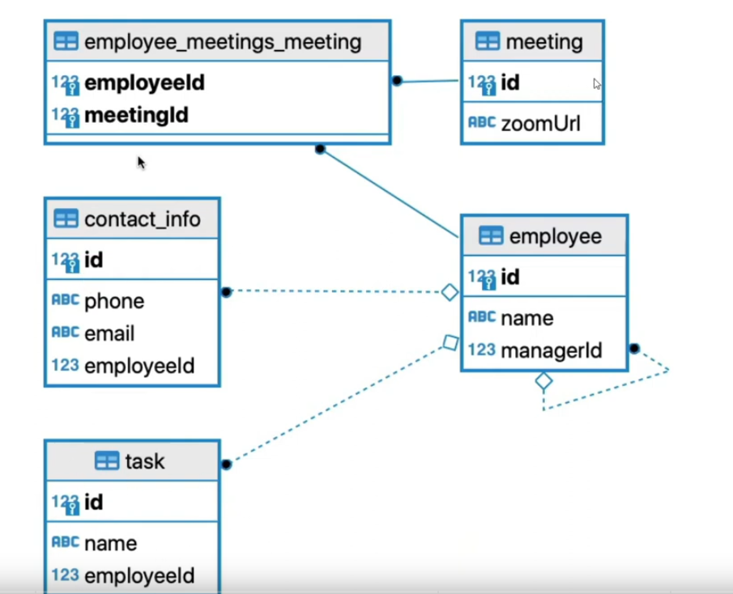

# NestJS CQRS REST APIs



## Description

Rest API Created following CQRS principles for study purposes

CQRS, which stands for Command Query Responsibility Segregation, is a software development principle that suggests separating read and write operations for improved performance and scalability.

In traditional applications, we often use the same models and methods to handle both reading data (queries) and updating data (commands). CQRS recommends splitting these responsibilities into separate parts:

**Commands:** These are actions that change the state of our application. For example, creating a new user, updating a profile, or deleting an item from a database. In NestJS, you would define controllers and services to handle these commands. Controllers receive incoming requests (like POST or PUT requests), validate data, and then pass it to services. Services handle business logic, perform operations (like saving to a database), and return results.

**Queries:** These are operations that retrieve data without changing it. For instance, fetching a list of users, retrieving a specific order details, or getting statistics. In NestJS, you would define controllers and services dedicated to handling queries. Controllers receive GET requests and delegate to services. Services fetch data from a database or other sources and return it to the client.

## Installation

```bash
$ yarn install
```

## Running the app

```bash
# development
$ yarn run start

# watch mode
$ yarn run start:dev

# production mode
$ yarn run start:prod
```

## Test

```bash
# unit tests
$ yarn run test

# e2e tests
$ yarn run test:e2e

# test coverage
$ yarn run test:cov
```